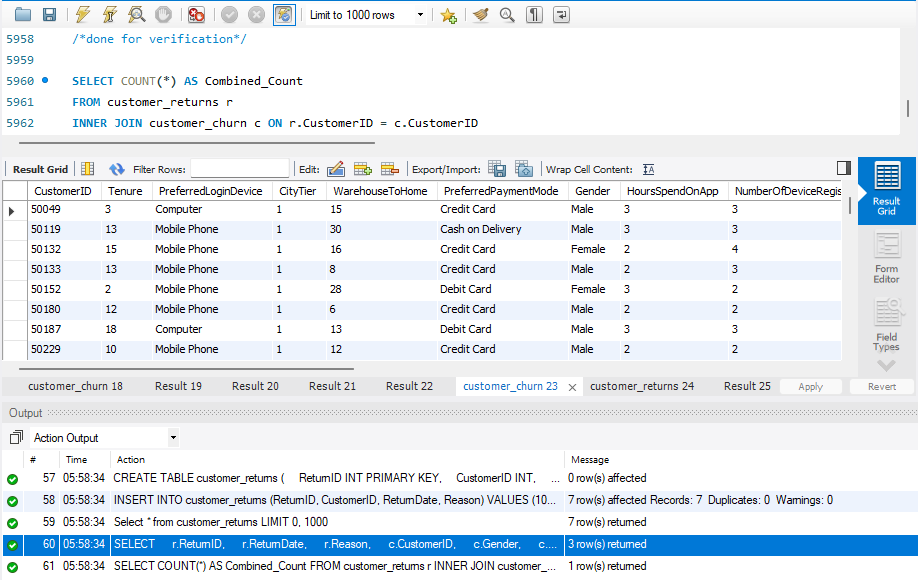

# 🛒 E-Commerce Customer Churn & Retention Analytics (MySQL)

An end-to-end SQL data analytics project focused on **E-Commerce Customer Churn Analysis, Data Cleaning (ETL), Behavioral Segmentation, and Return Correlation** using MySQL. 

This project covers database schema definition, handling missing values via mean/mode imputation, outlier removal, categorical standardization, column refactoring, and complex analytical SQL queries.

---

## 📌 Project Overview

Customer churn directly affects revenue and retention strategies. This project analyzes a customer dataset to diagnose churn patterns, evaluate the relationship between complaints and churn, track delivery distance impacts, and cross-reference churned profiles with product return histories.

### Key Objectives:
1. **Data Cleaning & Preprocessing (ETL)**: Impute missing numerical/categorical data using statistical mean and mode, eliminate spatial outliers (`WarehouseToHome > 100`), and standardize categorical values (`COD` $\rightarrow$ `Cash on Delivery`, `CC` $\rightarrow$ `Credit Card`, `Phone` $\rightarrow$ `Mobile Phone`).
2. **Schema Refactoring**: Enhance readability by adding descriptive status columns (`ChurnStatus`, `ComplaintReceived`) via `CASE` statements and dropping redundant raw bit flags.
3. **Exploratory & Diagnostic SQL Analytics**: Compute churn rates, average cashback, coupon distributions, preferred payment modes, and satisfaction score breakdowns across customer demographics.
4. **Relational Multi-Table Joining**: Link the primary `customer_churn` dataset with a secondary `customer_returns` table using `INNER JOIN` to identify return triggers among churned complainants.

---

## 🛠️ Tech Stack & SQL Concepts

* **Database Engine**: MySQL 8.0+ / Relational DBMS
* **Data Definition Language (DDL)**: `CREATE TABLE`, `ALTER TABLE`, `ADD/DROP/MODIFY/RENAME COLUMN`, `PRIMARY KEY`, `FOREIGN KEY`.
* **Data Manipulation Language (DML)**: `INSERT INTO`, `UPDATE ... SET`, `DELETE FROM`, `SET @variable` (Session Variables).
* **Data Cleaning & Imputation**:
  * Statistical Mean Imputation: `WarehouseToHome`, `HourSpendOnApp`, `OrderAmountHikeFromlastYear`, `DaySinceLastOrder`.
  * Statistical Mode Imputation: `Tenure`, `CouponUsed`, `OrderCount`.
* **Analytical Queries & Logic**:
  * **Relational Joins**: `INNER JOIN` connecting `customer_returns` and `customer_churn`.
  * **Conditional Logic**: `CASE WHEN` for distance binning (`Very Close`, `Close`, `Moderate`, `Far`) and boolean-to-string mapping.
  * **Aggregations & Grouping**: `COUNT()`, `SUM()`, `AVG()`, `MAX()`, `GROUP BY`, `HAVING`.
  * **Subqueries**: Filtering customers above average order thresholds and identifying usage patterns.

---

## 🗂️ Database Schema & Data Modeling

### 1. `customer_churn` (Master Customer Table)
* `CustomerID` (PK)
* `Tenure`, `PreferredLoginDevice`, `CityTier`, `WarehouseToHome`, `PreferredPaymentMode`, `Gender`
* `HoursSpendOnApp`, `NumberOfDeviceRegistered`, `PreferredOrderCat`, `SatisfactionScore`, `MaritalStatus`
* `NumberOfAddress`, `OrderAmountHikeFromlastYear`, `CouponUsed`, `OrderCount`, `DaySinceLastOrder`, `CashbackAmount`
* `ComplaintReceived` (`Yes`/`No`), `ChurnStatus` (`Churned`/`Active`)

### 2. `customer_returns` (Transactional Returns Table)
* `ReturnID` (PK)
* `CustomerID` (FK referencing `customer_churn`)
* `ReturnDate`, `Reason`

---

## 🔍 Key Business Questions & SQL Solutions

* **Complaint vs. Churn Ratio**: Calculated the percentage of churned users who submitted formal complaints.
* **Distance vs. Churn Categorization**: Segmented warehouse-to-home distances into dynamic bins (`<=5 km`, `5–10 km`, `10–15 km`, `>15 km`) to track churn distribution across delivery proximity.
* **Demographic & Category Trends**: Identified top churned categories by City Tier (e.g., *Laptop & Accessory* in Tier 1 cities) and evaluated coupon consumption across gender segments.
* **Return History for High-Risk Customers**: Joined returned orders with churned profiles who lodged complaints to audit root-cause return behaviors.
* **High-Value Customer Profiling**: Filtered married City Tier 1 customers placing orders above the overall platform average.

---

## 📊 SQL Execution Preview



---

## 🚀 How to Run the Project

1. **Clone the repository:**
   ```bash
   git clone [https://github.com/ashilbrayan/E-Commerce-Customer-Churn-Retention-Analysis-SQL-.git](https://github.com/ashilbrayan/E-Commerce-Customer-Churn-Retention-Analysis-SQL-.git)
   cd E-Commerce-Customer-Churn-Retention-Analysis-SQL-
